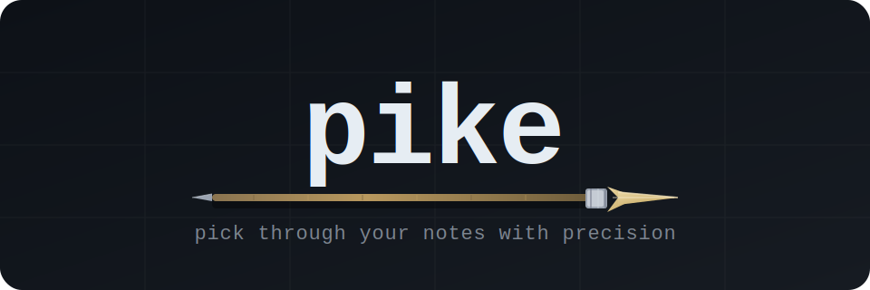

> **pike** /pa&#618;k/ *n.* — a long pointed tool, used to pick through things quickly and with precision.
>
> Your tasks are scattered across dozens of markdown files, buried between meeting notes and half-finished paragraphs. Pike reaches in and pulls them out.

---

Your notes are already in markdown. Your tasks are already in your notes. You don't need another app, another inbox, another tab. You need something that reads what you've already written and shows you what matters — in your terminal, where you already are.

Pike scans your notes directory for checkbox items (`- [ ]`/`- [x]`) and tagged bullets (`- text @tag`), groups them into configurable views via a query DSL, and renders them in an interactive TUI dashboard. No syncing, no database, no account. Just your files.

## Installation

### Nix

```bash
# Run directly (uses prebuilt binary)
nix run github:zachthieme/pike

# Install into profile
nix profile install github:zachthieme/pike

# Build from source instead
nix build github:zachthieme/pike#pike-src
```

### Go

```bash
go install github:zachthieme/pike/cmd/pike@latest
```

Or build locally:

```bash
go build -o pike ./cmd/pike
```

## Quick Start

```bash
# Point at your notes and launch the dashboard
pike --dir ~/notes

# Or set it in config and just run
pike
```

## Task Format

Tasks are extracted from markdown files. Two formats are recognized:

**Checkbox tasks** have explicit state:

```markdown
- [ ] Open task @today
- [x] Completed task @completed(2026-03-10)
```

**Tagged bullets** are plain list items that contain at least one `@tag`:

```markdown
- Review the auth design @talk
- Ship metrics endpoint @risk @due(2026-04-01)
```

Tags follow the format `@name` or `@name(value)`. Tag names are **case-sensitive** — `@Today` and `@today` are distinct tags. Use lowercase by convention.

### Special Tags

| Tag | Effect |
|-----|--------|
| `@due(YYYY-MM-DD)` | Sets the task's due date for date comparisons |
| `@completed` | Marks the task as completed (with or without a date) |
| `@completed(YYYY-MM-DD)` | Marks completed and records the completion date |
| `@hidden` | Hides the task from all views by default (toggle with `h`) |
| `@pin` | Floats the task to the top of its section |

Any other `@word` tag (e.g. `@today`, `@risk`, `@weekly`, `@talk`) is a plain tag used for filtering and categorization.

## Usage

```
pike [flags]
```

### Flags

| Flag | Short | Description |
|------|-------|-------------|
| `--dir <path>` | `-d` | Notes directory (overrides config and `$NOTES` env) |
| `--config <path>` | `-c` | Config file path |
| `--view <name>` | `-w` | Start focused on a named section |
| `--query <query>` | `-q` | Run a query, print results to stdout, and exit |
| `--scope <file>` | | Filter to tasks referencing the given file's subject |
| `--sort <order>` | | Sort order for `--query` mode (default: `file`) |
| `--summary` | | Print task summary counts and exit |
| `--color` | | Force color output |
| `--no-color` | | Disable color output |
| `--version` | `-v` | Print version |
| `--help` | `-h` | Print help |

### Examples

```bash
# Launch the TUI dashboard
pike

# Show only overdue tasks
pike -q "open and @due < today"

# List everything tagged @risk, sorted alphabetically
pike -q "@risk" --sort alpha

# Print a summary of open/overdue/due counts
pike --summary

# Start focused on the "Today" section
pike -w Today
```

### Scope

`--scope <file>` filters results to open tasks that reference a given file by name (wiki-links, plain filename, or display name). It works with `--query`, `--view`, `--json`, `--count`, and `--sort`.

```bash
pike --scope "Bob Smith.md"                           # open tasks referencing Bob
pike --scope "Bob Smith.md" --query "@talk"            # @talk tasks about Bob
pike --scope "Bob Smith.md" --view "Today"             # today's tasks about Bob
pike --scope "Bob Smith.md" --json                     # JSON output
pike --scope "Bob Smith.md" --count                    # count only
```

## Configuration

Config is loaded from (in order of precedence):

1. `--config` flag
2. `$PIKE_CONFIG` environment variable
3. `$XDG_CONFIG_HOME/pike/config.yaml`
4. `~/.config/pike/config.yaml`
5. Built-in defaults

### Config File

A default config using the [Catppuccin Mocha](https://github.com/catppuccin/catppuccin) color scheme is written to `~/.config/pike/config.yaml` on first run.

```yaml
# Directory containing your markdown notes (supports ~ expansion)
notes_dir: ~/notes

# File patterns to include (default: all .md files)
include:
  - "**/*.md"

# File patterns to exclude
exclude:
  - "templates/**"
  - "archive/**"

# How often to re-scan files for changes (default: 5s)
refresh_interval: 5s

# Editor command for opening tasks (default: $EDITOR, then hx)
editor: hx

# Days to show in recently-completed view (default: 7)
recently_completed_days: 7

# Day the week starts on: 0=Sunday, 1=Monday, ..., 6=Saturday (default: 0)
week_start_day: 0

# Color theme (Catppuccin Mocha)
# Supports named colors (red, green, etc.) and hex (#FF5733)
link_color: "#89b4fa"
hidden_color: "#6c7086"     # ○ icon when hidden tasks are concealed
visible_color: "#f5c2e7"    # ◉ icon when hidden tasks are revealed

tag_colors:
  risk: "#f38ba8"
  due: "#f38ba8"
  today: "#a6e3a1"
  completed: "#a6e3a1"
  weekly: "#89b4fa"
  horizon: "#f9e2af"
  talk: "#cba6f7"
  _default: "#94e2d5"       # fallback for unspecified tags

# Custom keybindings — remap actions or bind keys to queries/views
# keybindings:
#   toggle: ["space", "x"]
#   custom:
#     - key: "o"
#       view: "Overdue"                     # focus a dashboard view
#     - key: "d"
#       query: "open and @due < today+3d"   # run a query with one keypress

# Dashboard sections — each view is a filtered, sorted slice of your tasks
views:
  - title: "Today"
    query: "open and @today"
    sort: due_asc
    color: "#a6e3a1"
    order: 1

  - title: "Overdue"
    query: "open and @due < today"
    sort: due_asc
    color: "#f38ba8"
    order: 2

  - title: "This Week"
    query: "open and @due >= today and @due <= today+7d"
    sort: due_asc
    color: "#f9e2af"
    order: 3
```

### View Config Fields

| Field | Description |
|-------|-------------|
| `title` | Section header text |
| `query` | Query DSL expression to filter tasks |
| `sort` | Sort order for results |
| `color` | Section color (named or hex) |
| `order` | Display position (ascending) |

### Custom Keybindings

Remap built-in actions or create custom shortcuts that execute queries or focus views with a single keypress. Add a `keybindings:` section to your config:

```yaml
keybindings:
  # Remap built-in actions — list ALL keys you want (replaces defaults)
  toggle: ["space", "x"]
  quit: ["q", "ctrl+c"]

  # Custom shortcuts (replaces 1-9 focus keys when defined)
  custom:
    - key: "o"
      view: "Overdue"                     # focus a dashboard view by title
    - key: "d"
      query: "open and @due < today+3d"   # run an arbitrary query
    - key: "w"
      query: "open and @weekly"           # any query DSL expression works
```

Each custom shortcut binds a single key to **either** a `view` (focus a dashboard section by title) **or** a `query` (switch to all-tasks mode and execute the query DSL expression). You must specify exactly one of `view` or `query`.

| Field | Description |
|-------|-------------|
| `key` | Key to bind (e.g. `"o"`, `"ctrl+d"`) |
| `view` | Focus a dashboard section by its title |
| `query` | Execute a query DSL expression in all-tasks mode |

**Remappable actions:** `up`, `down`, `top`, `bottom`, `page_down`, `page_up`, `next_section`, `prev_section`, `enter`, `quit`, `summary`, `filter`, `query`, `escape`, `refresh`, `all_tasks`, `tag_search`, `toggle_hidden`, `toggle`, `toggle_hidden_tag`, `recently_completed`

When custom shortcuts are defined, the default `1`-`9` section focus keys are replaced. Custom shortcuts take priority over built-in keys on conflict. The `s` help overlay shows your actual configured bindings including custom shortcuts.

## Query DSL

The query language filters tasks by state, tags, dates, and text patterns. Queries are used in view configs and the `--query` flag. See [docs/query-dsl.md](docs/query-dsl.md) for the full reference (grammar, operators, date expressions, sort orders).

```
open and @due < today                   # overdue
open and @due = today                   # due exactly today
open and @due < tomorrow                # due today or overdue
completed and @completed >= today-7d    # completed in last week
open and (@weekly or @today)            # tagged weekly or today
open and not @risk                      # open, excluding risk
/deploy/                                # regex matches "deploy"
open and "meeting notes"                # quoted substring match
```

## TUI Keybindings

### Navigation

| Key | Action |
|-----|--------|
| `j` / `Down` | Move cursor down |
| `k` / `Up` | Move cursor up |
| `Ctrl+D` | Scroll down half page |
| `Ctrl+U` | Scroll up half page |
| `g` | Jump to top |
| `G` | Jump to bottom |
| `Tab` | Jump to next section |
| `Shift+Tab` | Jump to previous section |
| `1`-`9` | Focus on section N |
| `Esc` | Exit focus / dismiss summary |

### Actions

| Key | Action |
|-----|--------|
| `Enter` | Open task in editor at the correct line |
| `/` | Filter bar — substring search (prompt shows `/ `) |
| `?` | Query bar — DSL query mode (prompt shows `? `) |
| `a` | All tasks — show every task with substring search |
| `t` | Tag search — browse and pick a tag |
| `x` | Toggle task complete/incomplete |
| `H` | Toggle `@hidden` tag on selected task |
| `c` | Recently completed tasks (opens in query mode) |
| `h` | Toggle hidden tasks visibility (show/hide `@hidden` tasks) |
| `s` | Toggle summary overlay |
| `r` | Refresh (re-scan files) |
| `q` | Quit |

### Filter and Query Modes

Pike has two filter bar modes, each with a distinct prompt character:

| Key | Mode | Prompt | Behavior |
|-----|------|--------|----------|
| `/` | Substring | `/ ` | Case-insensitive substring matching (space-separated tokens, ANDed) |
| `?` | Query DSL | `? ` | Full query DSL with tags, dates, boolean operators, regex |

**Substring mode (`/`)** is for quick, free-form text search. Type any words and tasks containing all of them will match. `@tag` text is matched literally as a substring.

**Query mode (`?`)** uses the full query DSL. Parse errors are shown in the footer. The `c` (recently completed) view opens in query mode with a pre-filled DSL expression.

Press `Enter` to submit the filter and move focus to results. Press `Tab` to toggle focus between the filter bar and results. When results are focused, `j`/`k`, `g`/`G`, and `x` (toggle complete) work directly on tasks. Press `Tab` or `/` to return to editing the filter.

`Esc` behavior when the filter bar is focused: if there is text, clears the text; if already empty, exits filter mode.

| Key | Action |
|-----|--------|
| Type | Filter tasks across all sections |
| `Enter` | Submit filter and move focus to results |
| `Tab` | Toggle focus between filter bar and results |
| `Up` / `Down` / `Ctrl+P` / `Ctrl+N` | Move cursor up/down |
| `Ctrl+D` | Scroll down half page |
| `Ctrl+U` | Scroll up half page |
| `x` | Toggle task complete (when results focused) |
| `H` | Toggle `@hidden` tag (when results focused) |
| `j` / `k` / `g` / `G` | Navigate results (when results focused) |
| `/` | Return focus to filter bar (switches to substring mode) |
| `Enter` | Open selected task in editor (when results focused) |
| `Esc` | Clear text, or exit filter mode if empty |

### Tag Search Mode

Press `t` to browse all tags found in your notes. Tags are displayed in a compact flow-wrapped line. Matched tags are highlighted with their configured color, the selected tag gets reverse video, and non-matching tags are faint. Type to narrow matches (the `@` prefix is optional — both `@due` and `due` work). Selecting a tag shows all tasks with that tag, including completed tasks and tagged bullets.

| Key | Action |
|-----|--------|
| Type | Filter tag list (partial match, `@` optional) |
| `Tab` / `Down` | Cycle forward through matched tags |
| `Shift+Tab` / `Up` | Cycle backward through matched tags |
| `Enter` | Select tag and show all matching tasks |
| `Backspace` to empty | Return to tag search from filtered results |
| `Esc` | Cancel and return to dashboard |

### Hidden Tasks

Tasks tagged `@hidden` are excluded from all views by default. Sections that contain hidden tasks display a `○` icon next to their title. Press `h` to toggle visibility — when enabled, hidden tasks appear normally and the icon changes to `◉`. Both icon colors are configurable via `hidden_color` and `visible_color` in config.

This is useful for tasks you want to keep in your notes but don't need to see day-to-day (e.g., deferred items, low-priority backlog, sensitive tasks).

### Task Toggling

Press `x` on a checkbox task to toggle its completion state directly in the source file:

- **Completing:** `- [ ] Task` becomes `- [x] Task @completed(2026-03-14)` (today's date is appended)
- **Un-completing:** `- [x] Task @completed(2026-03-14)` becomes `- [ ] Task` (checkbox is unchecked and `@completed(...)` tag is removed)

Indented tasks and tasks with other tags are handled correctly. Non-checkbox tasks (tagged bullets) are not affected. If the file has been modified externally since the last scan, the toggle validates the line content before writing and shows an error if it doesn't match.

To toggle tasks while the query bar is active, press `Tab` to focus the results list first, then `x` to toggle.

### Recently Completed

Press `c` to see tasks completed in the last N days (configurable via `recently_completed_days` in config, default 7). The view opens in query mode (`? ` prompt) with a pre-filled DSL expression `completed and @completed >= today-Nd` which you can edit. Press `x` to un-complete a task (undo an accidental completion).

### Pinned Tasks

Tasks tagged `@pin` float to the top of their section, regardless of sort order. Within the pinned group and the unpinned group, the section's configured sort order is preserved.

## Display

Section headers show the task count: `Today (3)`. When hidden tasks exist, a visibility icon appears: `Today (3) ◌` (concealed) or `Today (3) ◉` (revealed via `h`).

### Task Markers

| Marker | Meaning |
|--------|---------|
| `○` | Open checkbox task |
| `●` | Completed checkbox task |
| `▸` | Tagged bullet (non-checkbox) |

### Link Prettification

Markdown syntax is cleaned up for display:

| Source | Display |
|--------|---------|
| `[[slug\|Display Name]]` | **Display Name** |
| `[[slug#Display Name]]` | **Display Name** |
| `[[Display Name]]` | **Display Name** |
| `[[zach-thieme]]` | **Zach Thieme** |
| `[link text](url)` | **link text** |
| `https://example.com/docs/guide` | **guide** |
| `https://github.com/org/repo/pull/123` | **pull/123** |

Links are rendered in bold with a configurable color (default: blue, set via `link_color` in config).

## Editor Integration

When you press `Enter` on a task, the configured editor opens the file at the task's line number. Editor argument syntax is auto-detected:

| Editor | Command |
|--------|---------|
| `hx` | `hx file:line` |
| `nvim` / `vim` | `nvim +line file` |
| `code` | `code --goto file:line` |
| Other | `$EDITOR file` |

## Project Structure

```
CHANGELOG.md                   Release history
docs/query-dsl.md              Query DSL reference
cmd/pike/main.go               CLI entrypoint and flag parsing
internal/
  model/task.go                Task, Tag, and TaskState types
  parser/parser.go             Markdown line parser
  config/config.go             YAML config loading with defaults
  query/
    lexer.go                   Query DSL tokenizer
    ast.go                     AST node types
    parser.go                  Recursive-descent parser
    eval.go                    AST evaluator
  sort/sort.go                 Task sorting (6 orders) and pin partitioning
  toggle/toggle.go             Task completion toggling (atomic file writes)
  scanner/scanner.go           File walker with mtime-based caching
  filter/filter.go             Query + sort pipeline, view engine
  editor/editor.go             Editor command construction
  render/render.go             Non-interactive stdout and JSON formatting
  style/style.go               Tag coloring, link prettification, task markers
  tui/
    model.go                   Bubbletea Model struct, Init, Update
    keys.go                    Key handlers and input dispatch
    modes.go                   Mode transitions, section rebuilding, filtering
    navigator.go               Cursor and section navigation
    filterbar.go               Filter bar sub-model (substring/DSL input)
    tagsearch.go               Tag search sub-model (tag picker)
    messages.go                Message types and shared enums
    views.go                   View rendering (dashboard, all-tasks, focused)
    sections.go                Section rendering with borders
    tasks.go                   Task formatting and utility functions
    styles.go                  Lipgloss style helpers and caches
    keymap.go                  Key bindings
    summary.go                 Summary overlay
testdata/                      Golden file test fixtures and expected outputs
golden_test.go                 Golden file test runner
```
