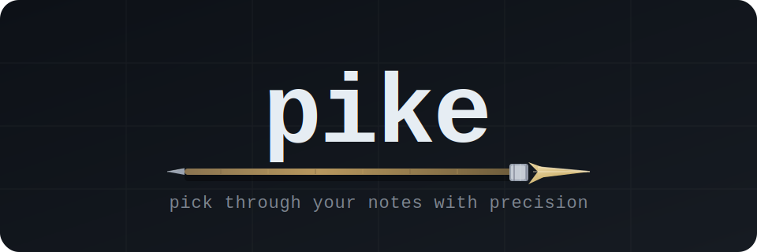

> **pike** /pa&#618;k/ *n.* — a long pointed tool, used to pick through things quickly and with precision.
>
> Your tasks are scattered across dozens of markdown files, buried between meeting notes and half-finished paragraphs. Pike reaches in and pulls them out.

---

Your notes are already in markdown. Your tasks are already in your notes. You don't need another app, another inbox, another tab. You need something that reads what you've already written and shows you what matters — in your terminal, where you already are.

Pike scans your notes directory for checkbox items (`- [ ]`/`- [x]`) and tagged bullets (`- text @tag`), groups them into configurable views via a query DSL, and renders them in an interactive TUI dashboard. No database, no account, and nothing running in the background — just your files. Optional [HEY](https://www.hey.com) sync is there when you want it, off until you enable it.

## Installation

### Nix

```bash
# Run directly (uses prebuilt binary)
nix run github:zachthieme/pike

# Install into profile
nix profile install github:zachthieme/pike

# Build from source instead
nix build github:zachthieme/pike#pike-src
```

### Go

```bash
go install github.com/zachthieme/pike/cmd/pike@latest
```

Or build locally:

```bash
go build -o pike ./cmd/pike
```

## Quick Start

```bash
# Point at your notes and launch the dashboard
pike --dir ~/notes

# Or set it in config and just run
pike
```

## Task Format

Tasks are extracted from markdown files. Two formats are recognized:

**Checkbox tasks** have explicit state:

```markdown
- [ ] Open task @today
- [x] Completed task @completed(2026-03-10)
```

**Tagged bullets** are plain list items that contain at least one `@tag`:

```markdown
- Review the auth design @talk
- Ship metrics endpoint @risk @due(2026-04-01)
```

Tags follow the format `@name` or `@name(value)`. Tag names are **case-sensitive** — `@Today` and `@today` are distinct tags. Use lowercase by convention.

Both Unix (LF) and Windows (CRLF) line endings are supported. When pike rewrites a line — completing a task, or a HEY sync — each line keeps its own ending, and a line pike appends to a CRLF file is written with CRLF too, so a file's line endings survive unchanged.

### Special Tags

| Tag | Effect |
|-----|--------|
| `@due(YYYY-MM-DD)` | Sets the task's due date for date comparisons |
| `@completed` | Marks the task as completed (with or without a date) |
| `@completed(YYYY-MM-DD)` | Marks completed and records the completion date |
| `@hidden` | Hides the task from all views by default (toggle with `h`) |
| `@pin` | Floats the task to the top of its section |

Any other `@word` tag (e.g. `@today`, `@risk`, `@weekly`, `@talk`) is a plain tag used for filtering and categorization.

## Usage

```
pike [flags]
```

### Flags

| Flag | Short | Description |
|------|-------|-------------|
| `--dir <path>` | `-d` | Notes directory (overrides config and `$NOTES` env) |
| `--config <path>` | `-c` | Config file path |
| `--view <name>` | `-w` | Start focused on a named section |
| `--query <query>` | `-q` | Run a query, print results to stdout, and exit |
| `--sync` | | Reconcile tasks with HEY (requires a `hey:` config block) |
| `--dry-run` | | With `--sync`, report what a sync would do and write nothing |
| `--scope <file>` | `-s` | Filter to tasks referencing the given file's subject |
| `--sort <order>` | | Sort order for `--query`/`--scope` mode (default: `file`) |
| `--count` | | Print result count only (use with `--query` or `--scope`) |
| `--json` | | Output results as JSON (use with `--query`, `--scope`, or `--sync`) |
| `--summary` | | Print task summary counts and exit |
| `--color` | | Force color output |
| `--no-color` | | Disable color output |
| `--debug` | | Print debug diagnostics to stderr |
| `--version` | `-v` | Print version |
| `--help` | `-h` | Print help |

### Examples

```bash
# Launch the TUI dashboard
pike

# Show only overdue tasks
pike -q "open and @due < today"

# List everything tagged @risk, sorted alphabetically
pike -q "@risk" --sort alpha

# Print a summary of open/overdue/due counts
pike --summary

# Start focused on the "Today" section
pike -w Today
```

### Scope

`--scope <file>` filters results to open tasks that reference a given file by name (wiki-links, plain filename, or display name). It works with `--query`, `--view`, `--json`, `--count`, and `--sort`.

```bash
pike --scope "Bob Smith.md"                           # open tasks referencing Bob
pike --scope "Bob Smith.md" --query "@talk"            # @talk tasks about Bob
pike --scope "Bob Smith.md" --view "Today"             # today's tasks about Bob
pike --scope "Bob Smith.md" --json                     # JSON output
pike --scope "Bob Smith.md" --count                    # count only
```

## Configuration

Config is loaded from (in order of precedence):

1. `--config` flag
2. `$PIKE_CONFIG` environment variable
3. `$XDG_CONFIG_HOME/pike/config.yaml`
4. `~/.config/pike/config.yaml`
5. Built-in defaults

### Config File

A default config using the [Catppuccin Mocha](https://github.com/catppuccin/catppuccin) color scheme is written to `~/.config/pike/config.yaml` on first run.

```yaml
# Directory containing your markdown notes (supports ~ expansion)
notes_dir: ~/notes

# File patterns to include (default: all .md files)
include:
  - "**/*.md"

# File patterns to exclude
exclude:
  - "templates/**"
  - "archive/**"

# How often to re-scan files for changes (default: 5s)
refresh_interval: 5s

# Editor command for opening tasks (default: $EDITOR, then hx)
editor: hx

# Days to show in recently-completed view (default: 7)
recently_completed_days: 7

# Day the week starts on: 0=Sunday, 1=Monday, ..., 6=Saturday (default: 0)
week_start_day: 0

# File (relative to notes_dir) that new tasks are appended to, including todos
# imported by HEY sync (default: inbox.md)
inbox_file: inbox.md

# Color theme (Catppuccin Mocha)
# Supports named colors (red, green, etc.) and hex (#FF5733)
link_color: "#89b4fa"
hidden_color: "#6c7086"     # ○ icon when hidden tasks are concealed
visible_color: "#f5c2e7"    # ◉ icon when hidden tasks are revealed

tag_colors:
  risk: "#f38ba8"
  due: "#f38ba8"
  today: "#a6e3a1"
  completed: "#a6e3a1"
  weekly: "#89b4fa"
  horizon: "#f9e2af"
  talk: "#cba6f7"
  _default: "#94e2d5"       # fallback for unspecified tags

# Custom keybindings — remap actions or bind keys to queries/views
# keybindings:
#   toggle: ["space", "x"]
#   custom:
#     - key: "o"
#       view: "Overdue"                     # focus a dashboard view
#     - key: "d"
#       query: "open and @due < today+3d"   # run a query with one keypress

# Dashboard sections — each view is a filtered, sorted slice of your tasks
views:
  - title: "Today"
    query: "open and @today"
    sort: due_asc
    color: "#a6e3a1"
    order: 1

  - title: "Overdue"
    query: "open and @due < today"
    sort: due_asc
    color: "#f38ba8"
    order: 2

  - title: "This Week"
    query: "open and @due >= today and @due <= today+7d"
    sort: due_asc
    color: "#f9e2af"
    order: 3
```

### View Config Fields

| Field | Description |
|-------|-------------|
| `title` | Section header text |
| `query` | Query DSL expression to filter tasks |
| `sort` | Sort order for results |
| `color` | Section color (named or hex) |
| `order` | Display position (ascending) |

### Custom Keybindings

Remap built-in actions or create custom shortcuts that execute queries or focus views with a single keypress. Add a `keybindings:` section to your config:

```yaml
keybindings:
  # Remap built-in actions — list ALL keys you want (replaces defaults)
  toggle: ["space", "x"]
  quit: ["q", "ctrl+c"]

  # Custom shortcuts (replaces 1-9 focus keys when defined)
  custom:
    - key: "o"
      view: "Overdue"                     # focus a dashboard view by title
    - key: "d"
      query: "open and @due < today+3d"   # run an arbitrary query
    - key: "w"
      query: "open and @weekly"           # any query DSL expression works
```

Each custom shortcut binds a single key to **either** a `view` (focus a dashboard section by title) **or** a `query` (switch to all-tasks mode and execute the query DSL expression). You must specify exactly one of `view` or `query`.

| Field | Description |
|-------|-------------|
| `key` | Key to bind (e.g. `"o"`, `"ctrl+d"`) |
| `view` | Focus a dashboard section by its title |
| `query` | Execute a query DSL expression in all-tasks mode |

**Remappable actions:** `up`, `down`, `top`, `bottom`, `page_down`, `page_up`, `next_section`, `prev_section`, `enter`, `quit`, `summary`, `filter`, `query`, `escape`, `refresh`, `all_tasks`, `tag_search`, `toggle_hidden`, `toggle`, `toggle_hidden_tag`, `recently_completed`, `create_task`, `toggle_collapse`, `sync`

When custom shortcuts are defined, the default `1`-`9` section focus keys are replaced. Custom shortcuts take priority over built-in keys on conflict. The `s` help overlay shows your actual configured bindings including custom shortcuts.

## HEY Sync

Pike can mirror tasks to and from [HEY](https://www.hey.com)'s to-do calendar so a
task lives in your notes but also shows up on your HEY week. Your notes stay the
primary home; HEY is a mirror pike keeps in step. Sync is **off** until you add a
`hey:` block to your config, and it never runs on its own — you invoke it with
`pike --sync` (or `S` in the TUI).

Sync requires a `hey` command-line tool on your `PATH`, authenticated to your
account (configurable via the `command` key below).

### Enabling it

Add a `hey:` block to your config:

```yaml
hey:
  command: hey                                    # the hey CLI to run
  query: "@due or @today"                         # which tasks push to HEY
  account: ""                                     # --account passed to hey (optional)
  state_path: ~/.local/share/pike/hey-state.json  # where the sync state lives
```

| Key | Default | Description |
|-----|---------|-------------|
| `command` | `hey` | The `hey` CLI command pike runs (looked up on `$PATH`) |
| `query` | `@due or @today` | The **Sync Query**: which eligible tasks are pushed to HEY as new todos |
| `account` | *(empty)* | Passed as `--account` to `hey` when set; omit for the default account |
| `state_path` | `$XDG_DATA_HOME/pike/hey-state.json` (falls back to `~/.local/share/pike/hey-state.json`) | The sync state file recording each link |

The block's mere presence is what enables sync; every key is optional and falls
back to the default above. An empty block also works: `hey: {}`, or a `hey:` key
with every child commented out (which loads as null), enables sync with all defaults.

To **disable** sync, remove the `hey:` block entirely — don't set it to a non-mapping
value. `hey:` must be a mapping (or empty); any other value — `hey: false`, a string,
a number, or a sequence — is rejected as a config error rather than silently enabling
defaults, so that `hey: false` never quietly turns sync *on*.

### Running a sync

```bash
pike --sync             # reconcile notes and HEY, writing both sides
pike --sync --dry-run   # report what a sync would do, write nothing
pike --sync --json      # machine-readable report
```

A sync is a two-way reconciliation:

- **Push** — every **eligible task** (an unlinked, open, non-hidden checkbox task)
  matching the Sync Query is created as a new HEY todo and linked. The todo's title
  is the task's text with all `@tags` stripped.
- **Import** — every unlinked, open HEY todo is appended to your inbox (see
  `inbox_file`) as a new task, dated to its week's Saturday and linked. If the todo's
  title contains `@` text — an email address like `bob@example.com`, a `@rent`, or even
  an `@due(...)` — pike writes it so the line parses with only its own `@due` and `@hey`
  tags, planting no stray tag that a later sync would misread as a title change (see
  [Titles containing `@`](#titles-containing-)).
- **Reconcile** — for tasks already linked, completion, title, and schedule changes
  are carried to whichever side is behind.

`--dry-run` runs the planning pass and prints the same report without touching your
notes, HEY, or the state file — use it to preview before committing.

### Titles containing `@`

A HEY title can contain an `@` that pike's parser would otherwise read as the start
of a tag — an email address like `bob@example.com`, a `@rent`, or even an
`@due(...)`. Writing such a title verbatim onto a task line would plant a stray tag
that the next sync misreads as a title change and re-creates with a mangled title. So
whenever pike writes a HEY title into your notes — both on **import** and when a
**HEY-side rename** is carried back to an existing task — it inserts an invisible
zero-width space (U+200B) directly after any `@` that would otherwise begin a tag.
That breaks the `@`-then-word adjacency the parser keys on, so the line parses with
only pike's own `@due` and `@hey` tags and the title round-trips unchanged.

This encoding is deliberate: it keeps HEY titles safe without touching pike's tag
grammar. It has two visible consequences. Some editors render the zero-width space —
vim, for instance, shows it as `<200b>`. And because the character sits between the
`@` and the following word, a plain-text search for `bob@example.com` will not match
the stored line (it contains `bob@<U+200B>example.com`).

The same paths also **fold the title to a single line** before writing it: a HEY
title containing a newline, carriage return, or tab has each run of whitespace
collapsed to one space and its ends trimmed, so a multi-line HEY todo becomes one
task line rather than splitting across two (which would leave a stray, unlinked
checkbox). This applies both on **import** and on a **HEY-side rename**, matching how
pike derives a title back from a task line, so a title unchanged since the last sync
still compares equal on both sides.

### The `@hey` tag (the Link)

A link between a task and its HEY todo is recorded as an `@hey(id)` tag written into
the task's own line, e.g.:

```markdown
- [ ] Ship the release notes @due(2026-04-01) @hey(133760954)
```

The tag travels with the line through reordering, moves between files, and rewording,
so the link survives edits that a sidecar file could not. A link is **sticky**: once
made it persists whether or not the task still matches the Sync Query.

A push writes this tag right after creating the todo. If that write is refused — for
example the task's line changed on disk since the scan — nothing in your notes would
record the new todo, so pike rolls the push back by deleting the todo it just added.
You are left where you started, with no untracked duplicate for the next sync to import.

### Sync never deletes

When one side of a link disappears, pike leaves the other in place — it never deletes
your data:

- A todo removed in HEY leaves the task in your notes, with its `@hey` tag stripped
  so a later sync can re-push it.
- A task line removed from your notes leaves the todo in HEY and is reported as an
  **orphan** warning.

Deletions are therefore always manual, on both sides. This is deliberate: "the line
is gone" is indistinguishable from a file excluded by a glob or temporarily
unparseable, and "the todo is gone" from an expired session — neither is trustworthy
enough to destroy data over.

### Un-linking a task by hand

To break the link between a task and its todo, delete the `@hey(id)` tag from the
task's line in your notes. The task becomes local-only again; the todo is left
untouched in HEY. A later sync will treat the now-unlinked task like any other and
re-push it as a **new** todo if it matches the Sync Query.

The old todo, no longer named by any tag, becomes an **orphan**: the next sync reports
it once as an orphan warning and then leaves it in place — it counts the orphan on
every later sync but does not repeat the warning. To finish the un-link, delete that
todo in HEY (or, if you meant to stop syncing the task entirely, remove it from the
Sync Query's reach so it is not re-pushed). Until you do, expect both the orphaned old
todo and the freshly pushed one to sit on your HEY week.

### Resetting the state file

The state file at `state_path` is a cache of what pike knew at the last sync; it is
not the source of truth (your notes and the `@hey` tags are). If it becomes corrupt
or you want a clean slate, delete it:

```bash
rm ~/.local/share/pike/hey-state.json
```

The next `pike --sync` rebuilds it from the `@hey` tags in your notes and the current
state of HEY. Because active links live in the tags, no live link is lost by
resetting the state, and you do not need to recreate the file or its folder by hand:
sync writes the state file on its next run and creates the default
`~/.local/share/pike/` directory for it automatically if it is missing.

Deleting the state file is **not** a fully lossless reset, though. Two kinds of
record live only in the state file and nowhere in your notes or in HEY: an **orphan**
(a todo whose task line is gone, held so the warning fires only once — see
[Un-linking a task by hand](#un-linking-a-task-by-hand)) and a **pending-delete**
todo (one pike created or superseded but could not delete). Both mark a todo pike
means to leave alone rather than import. Once the state is gone, the next sync no
longer recognises them: any such todo still open in HEY looks like an ordinary
unlinked todo and is imported into your inbox as a brand-new task — a duplicate you
did not want. (This is easy to reproduce: un-link a task by hand, then reset, and the
old orphaned todo comes back as a fresh inbox task on the next sync.)

So before you reset, clear both kinds of open todo that HEY would otherwise hand
back. First **list what is outstanding** with

```bash
pike --sync --dry-run --json
```

The report names every orphan and every pending-delete todo by id and title —
under the counts in text output, and as arrays in the `--json` object — so you can
see exactly what still lives only in the state file. Then run a normal
`pike --sync`: it retries and removes any pending-delete todos pike left behind, so
the reset does not resurrect them. Remove any orphaned todos from HEY yourself
(complete or delete them there) — pike leaves those in place deliberately, so a sync
will not clear them for you.

Before you delete the state file, **confirm that sync reported no failures**. A
pending-delete retry can fail (for example a briefly-unavailable `hey`), and a
failed retry now warns and counts a failure rather than passing silently — so a run
that still reports a failure means a pending delete was *not* cleared, and deleting
the state now would strand it as a duplicate. Only once a sync reports no failures,
with no stray open todos left for HEY to hand back, is deleting the state file — or
starting on a fresh machine with no state at all — a clean reset.

## Query DSL

The query language filters tasks by state, tags, dates, and text patterns. Queries are used in view configs and the `--query` flag. See [docs/query-dsl.md](docs/query-dsl.md) for the full reference (grammar, operators, date expressions, sort orders).

```
open and @due < today                   # overdue
open and @due = today                   # due exactly today
open and @due < tomorrow                # due today or overdue
completed and @completed >= today-7d    # completed in last week
open and (@weekly or @today)            # tagged weekly or today
open and not @risk                      # open, excluding risk
/deploy/                                # regex matches "deploy"
open and "meeting notes"                # quoted substring match
```

## TUI Keybindings

### Navigation

| Key | Action |
|-----|--------|
| `j` / `Down` | Move cursor down |
| `k` / `Up` | Move cursor up |
| `Ctrl+D` | Scroll down half page |
| `Ctrl+U` | Scroll up half page |
| `g` | Jump to top |
| `G` | Jump to bottom |
| `Tab` | Jump to next section |
| `Shift+Tab` | Jump to previous section |
| `1`-`9` | Focus on section N |
| `Esc` | Exit focus / dismiss summary |

### Actions

| Key | Action |
|-----|--------|
| `Enter` | Open task in editor at the correct line |
| `/` | Filter bar — substring search (prompt shows `/ `) |
| `?` | Query bar — DSL query mode (prompt shows `? `) |
| `a` | All tasks — show every task with substring search |
| `t` | Tag search — browse and pick a tag |
| `x` | Toggle task complete/incomplete |
| `i` | Create a new task (appended to your `inbox_file`) |
| `H` | Toggle `@hidden` tag on selected task |
| `c` | Recently completed tasks (opens in query mode) |
| `h` | Toggle hidden tasks visibility (show/hide `@hidden` tasks) |
| `s` | Toggle summary overlay |
| `r` | Refresh (re-scan files) |
| `S` | Sync with HEY (requires a `hey:` config block) |
| `q` | Quit |

### Filter and Query Modes

Pike has two filter bar modes, each with a distinct prompt character:

| Key | Mode | Prompt | Behavior |
|-----|------|--------|----------|
| `/` | Substring | `/ ` | Case-insensitive substring matching (space-separated tokens, ANDed) |
| `?` | Query DSL | `? ` | Full query DSL with tags, dates, boolean operators, regex |

**Substring mode (`/`)** is for quick, free-form text search. Type any words and tasks containing all of them will match. `@tag` text is matched literally as a substring.

**Query mode (`?`)** uses the full query DSL. Parse errors are shown in the footer. The `c` (recently completed) view opens in query mode with a pre-filled DSL expression.

Press `Enter` to submit the filter and move focus to results. Press `Tab` to toggle focus between the filter bar and results. When results are focused, `j`/`k`, `g`/`G`, and `x` (toggle complete) work directly on tasks. Press `Tab` or `/` to return to editing the filter.

`Esc` behavior when the filter bar is focused: if there is text, clears the text; if already empty, exits filter mode.

| Key | Action |
|-----|--------|
| Type | Filter tasks across all sections |
| `Enter` | Submit filter and move focus to results |
| `Tab` | Toggle focus between filter bar and results |
| `Up` / `Down` / `Ctrl+P` / `Ctrl+N` | Move cursor up/down |
| `Ctrl+D` | Scroll down half page |
| `Ctrl+U` | Scroll up half page |
| `x` | Toggle task complete (when results focused) |
| `H` | Toggle `@hidden` tag (when results focused) |
| `j` / `k` / `g` / `G` | Navigate results (when results focused) |
| `/` | Return focus to filter bar (switches to substring mode) |
| `Enter` | Open selected task in editor (when results focused) |
| `Esc` | Clear text, or exit filter mode if empty |

### Tag Search Mode

Press `t` to browse all tags found in your notes. Tags are displayed in a compact flow-wrapped line. Matched tags are highlighted with their configured color, the selected tag gets reverse video, and non-matching tags are faint. Type to narrow matches (the `@` prefix is optional — both `@due` and `due` work). Selecting a tag shows all tasks with that tag, including completed tasks and tagged bullets.

| Key | Action |
|-----|--------|
| Type | Filter tag list (partial match, `@` optional) |
| `Tab` / `Down` | Cycle forward through matched tags |
| `Shift+Tab` / `Up` | Cycle backward through matched tags |
| `Enter` | Select tag and show all matching tasks |
| `Backspace` to empty | Return to tag search from filtered results |
| `Esc` | Cancel and return to dashboard |

### Hidden Tasks

Tasks tagged `@hidden` are excluded from all views by default. Sections that contain hidden tasks display a `○` icon next to their title. Press `h` to toggle visibility — when enabled, hidden tasks appear normally and the icon changes to `◉`. Both icon colors are configurable via `hidden_color` and `visible_color` in config.

This is useful for tasks you want to keep in your notes but don't need to see day-to-day (e.g., deferred items, low-priority backlog, sensitive tasks).

### Task Toggling

Press `x` on a checkbox task to toggle its completion state directly in the source file:

- **Completing:** `- [ ] Task` becomes `- [x] Task @completed(2026-03-14)` (today's date is appended)
- **Un-completing:** `- [x] Task @completed(2026-03-14)` becomes `- [ ] Task` (checkbox is unchecked and `@completed(...)` tag is removed)

Indented tasks and tasks with other tags are handled correctly. Non-checkbox tasks (tagged bullets) are not affected. If the file has been modified externally since the last scan, the toggle validates the line content before writing and shows an error if it doesn't match.

To toggle tasks while the query bar is active, press `Tab` to focus the results list first, then `x` to toggle.

### Recently Completed

Press `c` to see tasks completed in the last N days (configurable via `recently_completed_days` in config, default 7). The view opens in query mode (`? ` prompt) with a pre-filled DSL expression `completed and @completed >= today-Nd` which you can edit. Press `x` to un-complete a task (undo an accidental completion).

### Pinned Tasks

Tasks tagged `@pin` float to the top of their section, regardless of sort order. Within the pinned group and the unpinned group, the section's configured sort order is preserved.

## Display

Section headers show the task count: `Today (3)`. When hidden tasks exist, a visibility icon appears: `Today (3) ◌` (concealed) or `Today (3) ◉` (revealed via `h`).

### Task Markers

| Marker | Meaning |
|--------|---------|
| `○` | Open checkbox task |
| `●` | Completed checkbox task |
| `▸` | Tagged bullet (non-checkbox) |

### Link Prettification

Markdown syntax is cleaned up for display:

| Source | Display |
|--------|---------|
| `[[slug\|Display Name]]` | **Display Name** |
| `[[slug#Display Name]]` | **Display Name** |
| `[[Display Name]]` | **Display Name** |
| `[[zach-thieme]]` | **Zach Thieme** |
| `[link text](url)` | **link text** |
| `https://example.com/docs/guide` | **guide** |
| `https://github.com/org/repo/pull/123` | **pull/123** |

Links are rendered in bold with a configurable color (default: blue, set via `link_color` in config).

## Editor Integration

When you press `Enter` on a task, the configured editor opens the file at the task's line number. Editor argument syntax is auto-detected:

| Editor | Command |
|--------|---------|
| `hx` | `hx file:line` |
| `nvim` / `vim` | `nvim +line file` |
| `code` | `code --goto file:line` |
| Other | `$EDITOR file` |

## Project Structure

```
CHANGELOG.md                   Release history
docs/query-dsl.md              Query DSL reference
cmd/pike/main.go               CLI entrypoint and flag parsing
internal/
  model/task.go                Task, Tag, and TaskState types
  parser/parser.go             Markdown line parser
  config/config.go             YAML config loading with defaults
  query/
    lexer.go                   Query DSL tokenizer
    ast.go                     AST node types
    parser.go                  Recursive-descent parser
    eval.go                    AST evaluator
  sort/sort.go                 Task sorting (6 orders) and pin partitioning
  toggle/toggle.go             Task completion toggling (atomic file writes)
  scanner/scanner.go           File walker with mtime-based caching
  filter/filter.go             Query + sort pipeline, view engine
  editor/editor.go             Editor command construction
  render/render.go             Non-interactive stdout and JSON formatting
  style/style.go               Tag coloring, link prettification, task markers
  tui/
    model.go                   Bubbletea Model struct, Init, Update
    keys.go                    Key dispatch and input routing
    actions.go                 Task actions (toggle, editor, hidden tag)
    modes.go                   Mode transitions, section rebuilding, filtering
    navigator.go               Cursor and section navigation
    filterbar.go               Filter bar sub-model (substring/DSL input)
    tagsearch.go               Tag search sub-model (tag picker)
    messages.go                Message types and shared enums
    views.go                   View rendering (dashboard, all-tasks, focused)
    sections.go                Section rendering with borders
    tasks.go                   Task formatting and utility functions
    styles.go                  Lipgloss style helpers and caches
    keymap.go                  Key bindings
    summary.go                 Summary overlay
testdata/                      Golden file test fixtures and expected outputs
golden_test.go                 Golden file test runner
```
